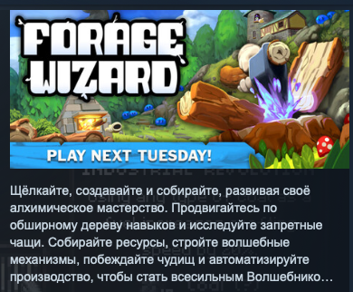

# Research

## Описание проекта
Создание прототипа копии игры [Forage Wizard](https://store.steampowered.com/app/3868320/Forage_Wizard/)

Продвигайтесь по дереву магических навыков, чтобы раскрыть секреты таинственной рощи. Собирайте предметы и превращайте их в могущественные магические материалы, а затем используйте те для создания собственной производственной базы. Вам также предстоит выращивать и собирать урожай, уничтожать монстров и автоматизировать своё алхимическое производство, чтобы отыскать могущественный артефакт.

## СОБИРАЙТЕ РЕСУРСЫ И РАСПОРЯЖАЙТЕСЬ ИМИ
Собирайте ресурсы в лесу с помощью своего могучего курсора, а затем перерабатывайте их в материалы для построек и последовательных улучшений.

ОТКРЫВАЙТЕ ПРОГРЕССИВНОЕ ДЕРЕВО НАВЫКОВ
Исследуйте постепенно открывающееся дерево навыков, меняющих игровой процесс. Выбирайте наиболее оптимальные улучшения, чтобы стать в итоге могущественным волшебником.

Стройте сооружения для переработки, хранения и производства ресурсов.

Занимайтесь алхимией. Переплавляйте руду в слитки. Создавайте хаос из стихий. Готовьте уникальные субстанции и используйте первозданную материю мира.
Собирайте ресурсы в стиле игр-кликеров: рубите лес, добывайте камень, пожинайте пшеницу! Вы даже сможете добывать материалы из кубов, появившихся до начала всех времён!
Используйте магазин чертежей, чтобы открывать новые постройки.
Убивайте монстров, чтобы получать из них ценные ресурсы, и занимайтесь фермерством.
Обменивайте ресурсы на золото.
Находите в чаще леса тайные уголки и исследуйте их.
Наслаждайтесь уникальным поступательным игровым процессом с постоянным наглядным прогрессом.
